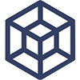

## Приветствую! :wave:
Я Full-Stack Веб-разработчик, UI/UX Дизайнер, призёр России по астрономии, турист, член [клуба Кубит  ](https://vk.com/qbitclub)  
Учусь в [ Гимназии №8 г. Глазов](https://vk.com/school8_glazov)  
15 лет  
На аве мой кот Борис

Show translate

I am a Full-Stack Web Developer, UI/UX Designer, Russian Astronomy Prize Winner, Tourist, Qubit Club Member  
I study at Gymnasium No. 8 in Glazov  
15 y. o.  
My cat Boris is on the avatar

## Знания: :mortar_board:

## Сейчас работаю над: :man_technologist:
+ [«Ищу наставника»](https://github.com/yegorweb/mentor-search)
+ «Афиша»
+ Образовательный контент для колледжа

## Следующие цели: :triangular_flag_on_post:
+ Вывести [«Ищу наставника»](https://github.com/yegorweb/mentor-search) на всероссийский уровень, им должна пользоваться каждая школа России
+ Начать преподавать уроки веб-разработки у себя в гимназии
+ MacBook Pro 14
+ Сделать «Гараж Гимназии №8»
+ Попасть в ОЦ «Сириус», «Артек»
